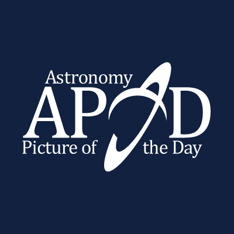

  
  

# Daily Dose of Cosmos

A simple desktop GUI for the NASA Astronomy Picture of the Day (APOD) API, made with Tkinter. This is my first hobby project, and I wanted to learn how to create GUI applications where a frontend is connected to backend functionality and HTTP request handling. I started the project to challenge myself and to create something for fun.

## Requirements

Python 3.12 or newer is needed to run the app.

Install the project dependencies from the repository root:

~~~powershell
pip install -r requirements.txt
~~~

## Run the app

Start the application from the repository root:

~~~powershell
python src/main.py
~~~

## Development checks

Run the unit tests:

~~~powershell
python -m unittest discover -s test
~~~

Check that the source and tests compile:

~~~powershell
python -m compileall -f src test
~~~

Run pylint:

~~~powershell
python -m pylint src test
~~~

The repository also includes GitHub Actions workflows for unit tests, pylint, CodeQL, and dependency review.

## Instructions of use

**API key:**  
For optimal usage of the NASA APOD API, I recommend visiting [NASA's](https://api.nasa.gov/) website to generate a personal API key. If this is not of interest, NASA provides `DEMO_KEY` for limited use.

If you use your own API key, it will be stored locally in *private/.env*, which will be created during run-time. This is ignored by git and stored indefinitely unless deleted manually.

**Date:**  
If no date is entered, the app defaults to the latest APOD date that should be available globally. Dates must use the format `YYYY-MM-DD` and must be no earlier than `1995-06-16`.

**Media:**  
Image APOD entries are displayed in the app. Video APOD entries can be opened in the browser.

## Project structure

~~~text
assets/     Images and app icons
private/    Local API key storage, ignored by git
src/        Application source code
test/       Unit tests
~~~

## Copyright

My application retrieves content from the NASA APOD API, and rights/credits to images/text lie with NASA or the stated authors.

It is therefore only the code for the project that is [licensed](LICENSE) under me.
